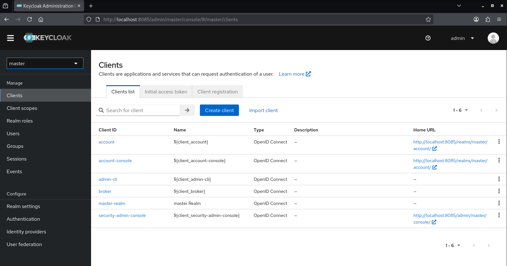
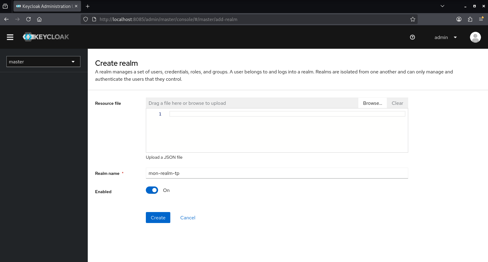
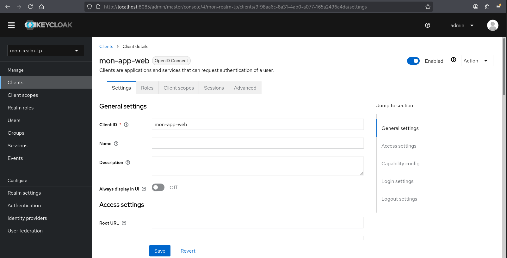
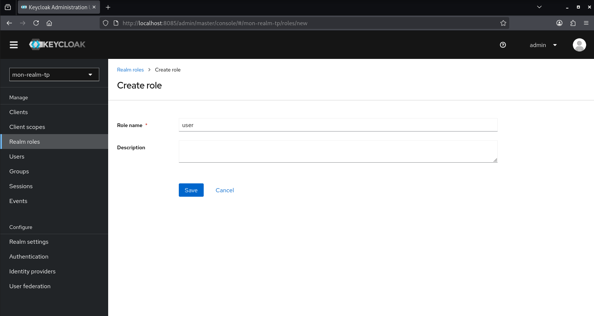
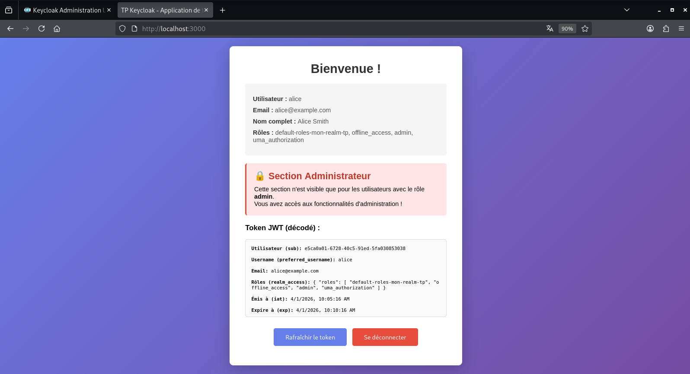
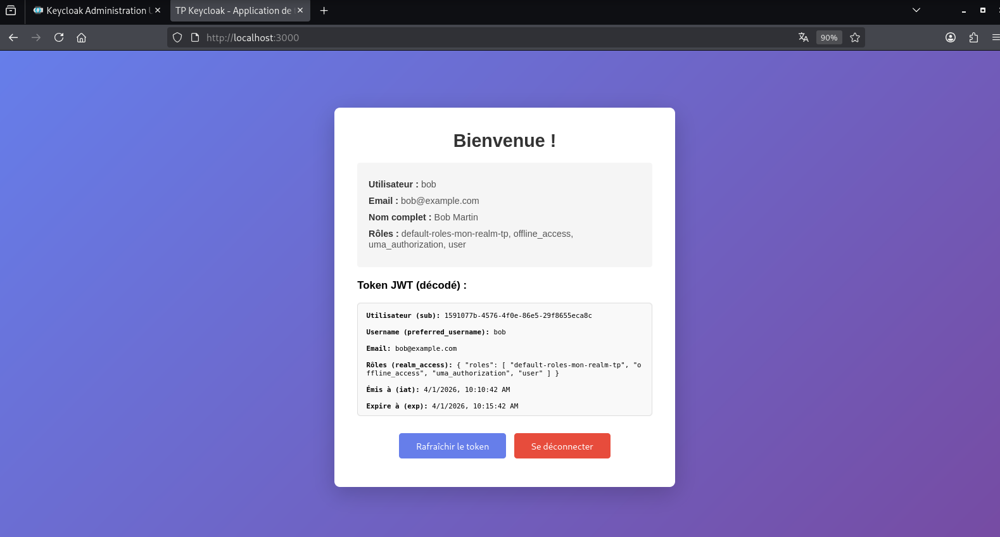

# Système IAM avec Keycloak

## Objectifs
- Installer et configurer Keycloak (Identity and Access Management)
- Créer un realm et configurer un client OpenID Connect
- Mettre en place un système de rôles et d'utilisateurs
- Tester l'authentification et le contrôle d'accès via une application web

## Prérequis
- Système : Linux
- Docker et Docker Compose installés
- Ports : 8085 (Keycloak), 3000 (Application web)

---

## 0. Préparation

### 0.1 Cloner le projet

```bash
git clone https://github.com/m1d0b4n/Doc-Keycloak.git
cd Doc-Keycloak
```

Tous les fichiers nécessaires sont déjà présents dans le dépôt.

---

## 1. Installation de Keycloak avec Docker

### 1.1 Fichier docker-compose.yml

Le fichier `docker-compose.yml` est déjà présent à la racine du projet avec le contenu suivant :

```yaml
services:
  keycloak:
    image: quay.io/keycloak/keycloak:23.0
    container_name: keycloak-tp4
    environment:
      KEYCLOAK_ADMIN: admin
      KEYCLOAK_ADMIN_PASSWORD: admin
    ports:
      - "8085:8080"
    command: start-dev
    restart: unless-stopped
```

### 1.2 Démarrer Keycloak

Depuis la racine du projet :

```bash
docker-compose up -d
```

### 1.3 Vérifier le démarrage

```bash
docker-compose logs -f keycloak
```

Attendre le message : "Running the server in development mode"

### 1.4 Accéder à la console d'administration

Ouvrir le navigateur web et accéder à : `http://localhost:8085`

**Identifiants :**
- Utilisateur : `admin`
- Mot de passe : `admin`



---

## 2. Configuration du Realm

### 2.1 Créer un nouveau realm

1. Cliquer sur le menu déroulant "master" en haut à gauche
2. Cliquer sur "Create realm"
3. Renseigner :
   - Realm name : `mon-realm-tp`
4. Cliquer sur "Create"



### 2.2 Vérifier le realm

Le realm "mon-realm-tp" doit maintenant apparaître dans le menu déroulant.

---

## 3. Configuration du Client OpenID Connect

### 3.1 Créer un nouveau client

1. Dans le menu de gauche, aller dans "Clients"
2. Cliquer sur "Create client"
3. Renseigner :
   - Client type : `OpenID Connect`
   - Client ID : `mon-app-web`
4. Cliquer sur "Next"

### 3.2 Configurer les options du client

5. Activer :
   - Client authentication : `OFF`
   - Authorization : `OFF`
   - Standard flow : `ON`
   - Direct access grants : `ON`
6. Cliquer sur "Next"

### 3.3 Configurer les URLs

7. Renseigner :
   - Valid redirect URIs : `http://localhost:3000/*`
   - Valid post logout redirect URIs : `http://localhost:3000/*`
   - Web origins : `http://localhost:3000`
8. Cliquer sur "Save"



---

## 4. Création des Rôles

### 4.1 Créer le rôle "admin"

1. Dans le menu de gauche, aller dans "Realm roles"
2. Cliquer sur "Create role"
3. Renseigner :
   - Role name : `admin`
   - Description : `Rôle administrateur`
4. Cliquer sur "Save"

### 4.2 Créer le rôle "user"

Répéter l'opération pour créer le rôle "user" :
- Role name : `user`
- Description : `Rôle utilisateur standard`



---

## 5. Création des Utilisateurs

### 5.1 Créer l'utilisateur Alice (Administrateur)

1. Dans le menu de gauche, aller dans "Users"
2. Cliquer sur "Add user"
3. Renseigner :
   - Username : `alice`
   - Email : `alice@example.com`
   - First name : `Alice`
   - Last name : `Smith`
4. Cliquer sur "Create"

### 5.2 Définir le mot de passe d'Alice

5. Aller dans l'onglet "Credentials"
6. Cliquer sur "Set password"
7. Renseigner :
   - Password : `alice123`
   - Password confirmation : `alice123`
   - Temporary : `OFF`
8. Cliquer sur "Save"

### 5.3 Attribuer le rôle admin à Alice

9. Aller dans l'onglet "Role mapping"
10. Cliquer sur "Assign role"
11. Sélectionner le rôle `admin`
12. Cliquer sur "Assign"

### 5.4 Créer l'utilisateur Bob (Utilisateur standard)

Répéter les étapes 5.1 à 5.3 pour Bob :
- Username : `bob`
- Email : `bob@example.com`
- First name : `Bob`
- Last name : `Jones`
- Password : `bob123`
- Rôle : `user` (pas admin)

> **Note :** Les utilisateurs sont créés via l'interface d'administration Keycloak.

---

## 6. Déploiement de l'Application Web

### 6.1 Structure des fichiers

[Cliquez ici pour voir les fichiers de l'app web](./webapp/)

```
Doc-Keycloak/
├── README.md
├── Doc.md
├── docker-compose.yml
├── img/
│   └── (screenshots)
└── webapp/    <---------------------- Dossier de l'app web
    ├── index.html
    ├── app.js
    └── server.py
```

### 6.2 Code source des fichiers

<details>
<summary><strong>📄 index.html</strong> (cliquez pour afficher le code)</summary>

```html
<!DOCTYPE html>
<html lang="fr">
<head>
    <meta charset="UTF-8">
    <meta name="viewport" content="width=device-width, initial-scale=1.0">
    <title>Keycloak - Application de test</title>
    <style>
        * { margin: 0; padding: 0; box-sizing: border-box; }
        body {
            font-family: Arial, sans-serif;
            background: linear-gradient(135deg, #667eea 0%, #764ba2 100%);
            min-height: 100vh;
            display: flex;
            justify-content: center;
            align-items: center;
            padding: 20px;
        }
        .container {
            background: white;
            border-radius: 10px;
            box-shadow: 0 10px 40px rgba(0,0,0,0.2);
            padding: 40px;
            max-width: 600px;
            width: 100%;
        }
        h1 {
            color: #333;
            margin-bottom: 20px;
            text-align: center;
        }
        .user-info {
            background: #f5f5f5;
            border-radius: 5px;
            padding: 20px;
            margin: 20px 0;
        }
        .user-info p {
            margin: 10px 0;
            color: #555;
        }
        .user-info strong {
            color: #333;
        }
        button {
            background: #667eea;
            color: white;
            border: none;
            padding: 12px 30px;
            border-radius: 5px;
            cursor: pointer;
            font-size: 16px;
            margin: 10px 5px;
            transition: background 0.3s;
        }
        button:hover {
            background: #5568d3;
        }
        .logout-btn {
            background: #e74c3c;
        }
        .logout-btn:hover {
            background: #c0392b;
        }
        .admin-section {
            background: #ffe5e5;
            border-left: 4px solid #e74c3c;
            padding: 20px;
            margin: 20px 0;
            border-radius: 5px;
        }
        .admin-section h2 {
            color: #c0392b;
            margin-bottom: 10px;
        }
        .hidden {
            display: none;
        }
        .login-screen {
            text-align: center;
        }
        .login-screen p {
            color: #666;
            margin: 20px 0;
        }
        .token-display {
            background: #f9f9f9;
            border: 1px solid #ddd;
            padding: 15px;
            margin: 20px 0;
            border-radius: 5px;
            max-height: 200px;
            overflow-y: auto;
            font-family: monospace;
            font-size: 12px;
            word-break: break-all;
        }
    </style>
</head>
<body>
    <div class="container">
        <!-- Écran de connexion -->
        <div id="login-screen" class="login-screen">
            <h1>Application de test IAM</h1>
            <p>Cette application utilise Keycloak pour l'authentification</p>
            <button onclick="login()">Se connecter</button>
        </div>

        <!-- Écran principal (après connexion) -->
        <div id="main-screen" class="hidden">
            <h1>Bienvenue !</h1>
            
            <div class="user-info">
                <p><strong>Utilisateur :</strong> <span id="username"></span></p>
                <p><strong>Email :</strong> <span id="email"></span></p>
                <p><strong>Nom complet :</strong> <span id="fullname"></span></p>
                <p><strong>Rôles :</strong> <span id="roles"></span></p>
            </div>

            <!-- Section visible uniquement pour les admins -->
            <div id="admin-section" class="admin-section hidden">
                <h2>🔒 Section Administrateur</h2>
                <p>Cette section n'est visible que pour les utilisateurs avec le rôle <strong>admin</strong>.</p>
                <p>Vous avez accès aux fonctionnalités d'administration !</p>
            </div>

            <!-- Affichage du token JWT -->
            <h3>Token JWT (décodé) :</h3>
            <div class="token-display" id="token-display"></div>

            <div style="text-align: center; margin-top: 20px;">
                <button onclick="refreshToken()">Rafraîchir le token</button>
                <button class="logout-btn" onclick="logout()">Se déconnecter</button>
            </div>
        </div>
    </div>

    <!-- Keycloak JavaScript Adapter -->
    <script src="http://localhost:8085/js/keycloak.js"></script>
    <script src="app.js"></script>
</body>
</html>
```

</details>

<details>
<summary><strong>📄 app.js</strong> (cliquez pour afficher le code)</summary>

```javascript
// Configuration Keycloak
const keycloak = new Keycloak({
    url: 'http://localhost:8085',
    realm: 'mon-realm-tp',
    clientId: 'mon-app-web'
});

// Initialisation de Keycloak
keycloak.init({
    onLoad: 'check-sso',
    checkLoginIframe: false
}).then(authenticated => {
    if (authenticated) {
        showMainScreen();
    } else {
        showLoginScreen();
    }
}).catch(error => {
    console.error('Erreur d\'initialisation Keycloak:', error);
});

// Fonction de connexion
function login() {
    keycloak.login();
}

// Fonction de déconnexion
function logout() {
    keycloak.logout({
        redirectUri: window.location.origin
    });
}

// Rafraîchir le token
function refreshToken() {
    keycloak.updateToken(30).then(refreshed => {
        if (refreshed) {
            console.log('Token rafraîchi');
            displayTokenInfo();
        } else {
            console.log('Token toujours valide');
        }
    }).catch(error => {
        console.error('Erreur lors du rafraîchissement:', error);
        logout();
    });
}

// Afficher l'écran de connexion
function showLoginScreen() {
    document.getElementById('login-screen').classList.remove('hidden');
    document.getElementById('main-screen').classList.add('hidden');
}

// Afficher l'écran principal
function showMainScreen() {
    document.getElementById('login-screen').classList.add('hidden');
    document.getElementById('main-screen').classList.remove('hidden');
    
    // Charger les informations utilisateur
    keycloak.loadUserProfile().then(profile => {
        document.getElementById('username').textContent = profile.username || 'N/A';
        document.getElementById('email').textContent = profile.email || 'N/A';
        document.getElementById('fullname').textContent = 
            `${profile.firstName || ''} ${profile.lastName || ''}`.trim() || 'N/A';
        
        // Afficher les rôles
        const roles = keycloak.realmAccess?.roles || [];
        document.getElementById('roles').textContent = roles.join(', ') || 'Aucun rôle';
        
        // Vérifier si l'utilisateur est admin
        if (keycloak.hasRealmRole('admin')) {
            document.getElementById('admin-section').classList.remove('hidden');
        }
        
        // Afficher le token
        displayTokenInfo();
    }).catch(error => {
        console.error('Erreur lors du chargement du profil:', error);
    });
}

// Décoder et afficher le token JWT
function displayTokenInfo() {
    if (keycloak.token) {
        try {
            const tokenParsed = keycloak.tokenParsed;
            const tokenInfo = {
                'Utilisateur (sub)': tokenParsed.sub,
                'Username (preferred_username)': tokenParsed.preferred_username,
                'Email': tokenParsed.email,
                'Rôles (realm_access)': JSON.stringify(tokenParsed.realm_access, null, 2),
                'Émis à (iat)': new Date(tokenParsed.iat * 1000).toLocaleString(),
                'Expire à (exp)': new Date(tokenParsed.exp * 1000).toLocaleString(),
                'Issuer (iss)': tokenParsed.iss
            };
            
            let display = '';
            for (const [key, value] of Object.entries(tokenInfo)) {
                display += `<strong>${key}:</strong> ${value}<br><br>`;
            }
            
            document.getElementById('token-display').innerHTML = display;
        } catch (error) {
            console.error('Erreur lors du décodage du token:', error);
        }
    }
}

// Auto-refresh du token toutes les 30 secondes
setInterval(() => {
    if (keycloak.authenticated) {
        keycloak.updateToken(70).catch(() => {
            console.error('Failed to refresh token');
        });
    }
}, 30000);
```

</details>

<details>
<summary><strong>📄 server.py</strong> (cliquez pour afficher le code)</summary>

```python
#!/usr/bin/env python3
import http.server
import socketserver

PORT = 3000

Handler = http.server.SimpleHTTPRequestHandler

with socketserver.TCPServer(("", PORT), Handler) as httpd:
    print(f"Serveur démarré sur http://localhost:{PORT}")
    print("Appuyez sur Ctrl+C pour arrêter")
    httpd.serve_forever()
```

</details>

### 6.3 Démarrer le serveur web

Depuis la racine du projet, accéder au dossier webapp :

```bash
cd webapp
python3 server.py
```

Le serveur démarre sur `http://localhost:3000`

---

## 7. Tests d'Authentification

### 7.1 Accéder à l'application

Ouvrir le navigateur web et accéder à : `http://localhost:3000`

### 7.2 Test avec Alice (Administrateur)

1. Cliquer sur "Se connecter"
2. Saisir les identifiants :
   - Username or email : `alice`
   - Password : `alice123`
3. Cliquer sur "Sign In"

**Résultat attendu :**
- Affichage des informations utilisateur
- La section "Section Administrateur" est visible (bordure rouge)
- Le token JWT est décodé et affiché
- Les rôles incluent : `admin`



### 7.3 Test avec Bob (Utilisateur standard)

1. Se déconnecter
2. Se reconnecter avec les identifiants de Bob :
   - Username or email : `bob`
   - Password : `bob123`

**Résultat attendu :**
- Affichage des informations utilisateur
- La section "Section Administrateur" n'est PAS visible
- Le token JWT est décodé et affiché
- Les rôles incluent : `user` (mais pas `admin`)



---

## 8. Analyse du Token JWT

### 8.1 Structure du token

Le token JWT affiché contient :
- **Utilisateur (sub)** : Identifiant unique de l'utilisateur
- **Username (preferred_username)** : Nom d'utilisateur
- **Email** : Adresse email
- **Rôles (realm_access)** : Liste des rôles attribués
- **Émis à (iat)** : Date/heure d'émission du token
- **Expire à (exp)** : Date/heure d'expiration du token

### 8.2 Fonction de rafraîchissement

Le bouton "Rafraîchir le token" permet de renouveler le token avant son expiration.

---

## 9. Contrôle d'Accès par Rôles

### 9.1 Principe

L'application vérifie la présence du rôle `admin` dans le token JWT :

```javascript
function hasRealmRole(role) {
    return keycloak.hasRealmRole(role);
}
```

### 9.2 Affichage conditionnel

La section administrateur n'est affichée que si l'utilisateur possède le rôle `admin` :

```javascript
if (hasRealmRole('admin')) {
    document.getElementById('admin-section').style.display = 'block';
}
```

---

## 10. Arrêt et Redémarrage

### 10.1 Arrêter l'application web

Dans le terminal où le serveur Python tourne :
```bash
Ctrl+C
```

### 10.2 Arrêter Keycloak

Depuis la racine du projet :

```bash
docker-compose down
```

### 10.3 Redémarrer Keycloak

```bash
docker-compose up -d
```

Les données (realm, clients, utilisateurs, rôles) sont conservées dans le volume Docker.

---

## 11. Vérifications et Diagnostics

### 11.1 Vérifier que Keycloak est actif

```bash
docker-compose ps
```

### 11.2 Consulter les logs

```bash
docker-compose logs -f keycloak
```

### 11.3 Redémarrer en cas de problème

```bash
docker-compose restart keycloak
```
